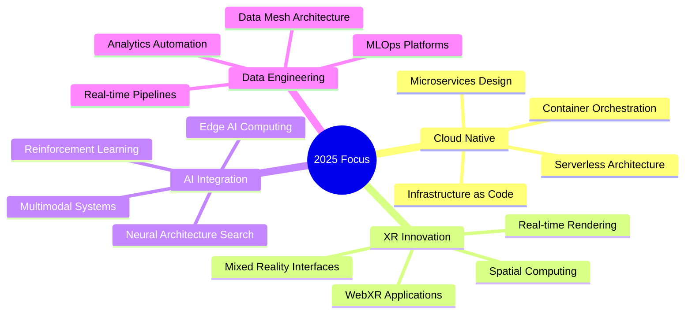

  

<!-- SOCIAL LINKS -->

  
  
  
  
  

---

## 🚀 About Me

  

> **Building the future at the intersection of data, cloud, and immersive technologies**

Software Engineer with **Aus/EU citizenship**, specializing in multi-domain engineering solutions. I architect scalable data pipelines, deploy cloud-native applications, and create immersive XR experiences that push technological boundaries.

**Current Focus:** Exploring AI-driven automation, cloud-native architectures, and next-generation XR interfaces.

---

## 🛠️ Technical Toolkit

  
### Core Specializations

### Technology Stack

---

## 🎯 Domain Expertise

### 📊 Data Engineering

*ETL Pipelines • Data Analytics • ML Operations*

### ☁️ DevOps & Cloud

*Infrastructure as Code • CI/CD • Orchestration*

### 💻 Software Development

*Full-Stack Development • Web APIs • Real-time Systems*

### 🥽 XR & Immersive Tech

*Virtual Reality • Augmented Reality • 3D Visualization*

### 🏗️ Architecture & Design

*Architectural Visualization • 3D Modeling • CAD Design*

---

## 🌟 Featured Projects

### 🏢 3D Visualization & Architectural Rendering

<table width="100%">
<tr>
<td width="50%" align="center">

#### 🏠 **Altman House Kitchen Refurbishment**

Detailed visualization of a kitchen refurbishment project demonstrating photorealistic interior renderings with precise material textures, custom cabinetry, and realistic lighting.

</td>
<td width="50%" align="center">

#### 🏡 **Interactive Architectural Visualization**

Professional residential architecture visualization created in Unreal Engine showcasing photo-realistic environments with detailed interiors and dynamic lighting.

</td>
</tr>
</table>

### 🎨 Creative Coding & Generative Art

<table width="100%">
<tr>
<td width="33%" align="center">

#### 🌊 **Erosion Simulation**

Interactive 3D terrain erosion simulation demonstrating hydraulic erosion with real-time water flow and sediment deposition.

</td>
<td width="33%" align="center">

#### 🐦 **Flocking Simulation**

3D implementation of the Boids algorithm simulating natural flocking behaviors with separation, alignment, and cohesion.

</td>
<td width="33%" align="center">

#### 🔗 **Edge Bundling**

Interactive 3D network visualization using force-directed edge bundling for elegant cluster visualization.

</td>
</tr>
<tr>
<td width="33%" align="center">

#### 🌀 **Gyroid Visualization**

Real-time visualization of the Gyroid minimal surface using Marching Cubes algorithm in native JavaScript.

</td>
<td width="33%" align="center">

#### 💫 **Flow Fields**

Immersive 3D flow field visualization simulating fluid-like particle motion using Perlin noise.

</td>
<td width="33%" align="center">

#### 🌱 **Differential Growth**

Interactive 3D differential mesh growth creating organic, emergent structures with adaptive curvature refinement.

</td>
</tr>
</table>

### 🤖 Machine Learning & AI Projects

<table width="100%">
<tr>
<td width="50%" align="center">

#### 🍟 **McDeepNet**

Machine Learning model trained on 20,000 McDonald's reviews using RNNs for sentiment analysis with real-time prediction capabilities.

</td>
<td width="50%" align="center">

#### 🔗 **LangChainGPT**

Python library for natural language processing, text embedding, document indexing, and information retrieval systems. Makes it easy to leverage the power of language models for various applications.

</td>
</tr>
</table>

---

## 🏆 Professional Certifications

### Certification Portfolio

### 🔷 Microsoft Azure
**Data Engineer Associate** • **Data Scientist Associate** • **AI Engineer Associate** • **AI Fundamentals** • **Data Fundamentals** • **Azure Fundamentals** • **Security & Identity** • **DevOps Solutions**

### ⚡ GitLab  
**CI/CD Associate** • **Git Associate** • **Security Specialist** • **Project Management** • **Implementation Services** • **Services Engineer** • **Migration Services** • **GitLab CI**

### ☁️ AWS & Google Cloud
**Cloud Practitioner** • **Generative AI** • **ML Foundations** • **Serverless Computing** • **LLM Introduction** • **Responsible AI**

### 📊 Data Science & Security
**OpenAI API Systems** • **Time Series ML** • **TensorFlow/OpenCV** • **Cisco Cybersecurity** • **Linux Essentials** • **Python PCEP** • **IBM Deep Learning** • **Containers/Kubernetes** • **COBOL Programming**

  
<i>A comprehensive collection of professional certifications validating expertise across cloud platforms, DevOps practices, AI, data science, and security domains.</i>

---

## 📊 GitHub Analytics

  

<table>
<tr>
<td align="center">
  
</td>
<td align="center">
  
</td>
<td align="center">
  
</td>
</tr>
</table>

---

## 🎯 Current Focus & Initiatives

  

### Strategic Development Areas

---

  

